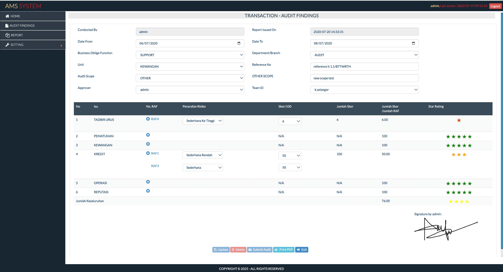

# audit-management-system

The Audit Management System is designed to help organizations manage and track audit findings efficiently. This system allows users to log, monitor, and resolve audit issues using a simple and intuitive interface.

## Features

- User authentication and authorization
- Create, read, update, and delete audit findings
- Assign audit findings to responsible personnel
- Personnel need to digitally sign the audits as part of the approval process
- Track the status of each audit finding
- Generate reports on audit findings

## Getting Started

### 1. Clone the Repository

```sh
 git clone https://github.com/yourusername/audit-management-system.git
```

### 2. Navigate to the Project

```sh
cd audit-management-system
```

### 3. Import Database
```sh
mysql -u username -p database_name < database/ams.sql
```

### 5. Open your browser and navigate to
```sh
http://localhost:8000
```

 # What You Should See

 Below is an example of the output you should see:

